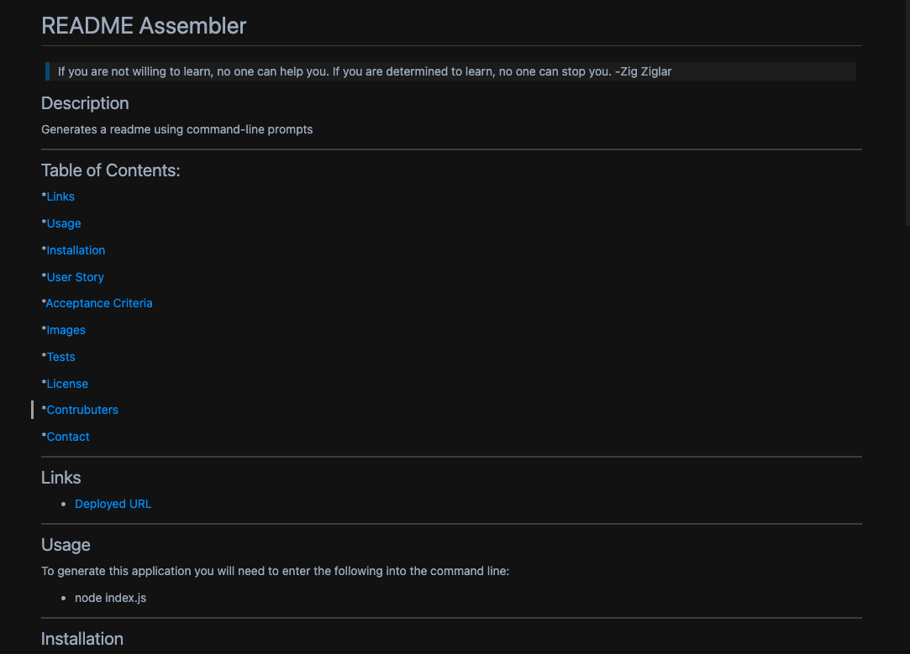
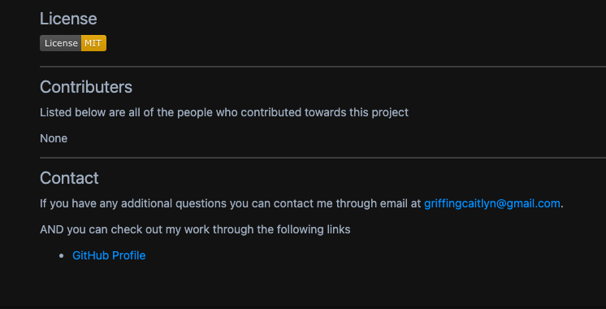
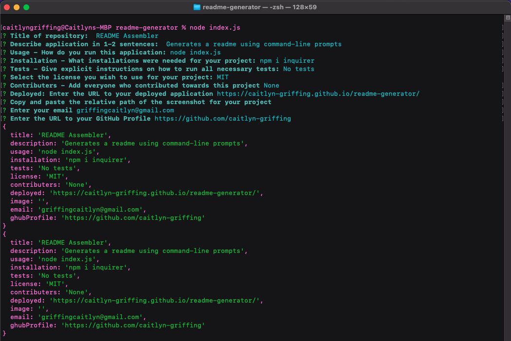
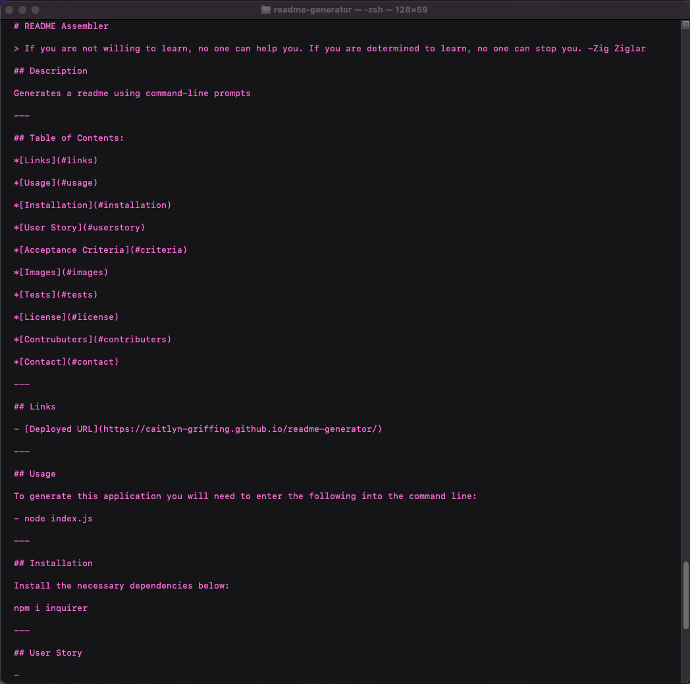
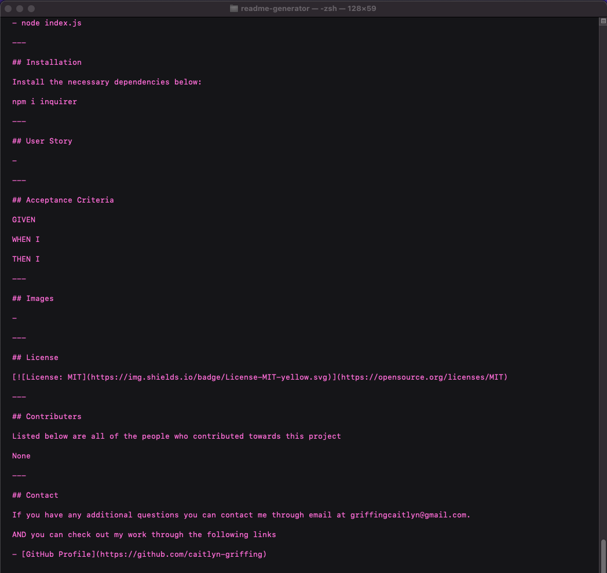

# README Assembler

> If you are not willing to learn, no one can help you. If you are determined to learn, no one can stop you. -Zig Ziglar

## Description

When creating an open source project on GitHub, it's important to have a high-quality README for the app. This should include (but is not limited to) what the app is for, how to use the app, how to install it, how to report issues, and how to make contributions. This application quickly creates a README file by using command-line prompts and user input.

---

## Table of Contents

*[Important Links](#links)

*[Usage](#usage)

*[Installation](#installation)

*[User Story](#user-story)

*[Acceptance Criteria](#acceptance-criteria)

*[License](#license)

*[Images](#images)

*[Contact](#contact)

---

## Important Links

- [Demo Video](https://youtu.be/CPrhwmOUTO4)

- [GitHub URL](https://github.com/caitlyn-griffing/readme-generator)

---

## Usage

To generate this application you will need to enter the following into the command line:

- node index.js

---

## Installation

Below are the required installations for this application:

- npm install inquirer

---

## User Story

```md
AS A developer
I WANT a README generator
SO THAT I can quickly create a professional README for a new project
```

---

## Acceptance Criteria

```md
GIVEN a command-line application that accepts user input
WHEN I am prompted for information about my application repository
THEN a high-quality, professional README.md is generated with the title of my project and sections entitled Description, Table of Contents, Installation, Usage, License, Contributing, Tests, and Questions
WHEN I enter my project title
THEN this is displayed as the title of the README
WHEN I enter a description, installation instructions, usage information, contribution guidelines, and test instructions
THEN this information is added to the sections of the README entitled Description, Installation, Usage, Contributing, and Tests
WHEN I choose a license for my application from a list of options
THEN a badge for that license is added near the top of the README and a notice is added to the section of the README entitled License that explains which license the application is covered under
WHEN I enter my GitHub username
THEN this is added to the section of the README entitled Questions, with a link to my GitHub profile
WHEN I enter my email address
THEN this is added to the section of the README entitled Questions, with instructions on how to reach me with additional questions
WHEN I click on the links in the Table of Contents
THEN I am taken to the corresponding section of the README
```

---

## License

[](https://opensource.org/licenses/MIT)

---

## Images











## Contact

If you have any additional questions you can contact me through email at griffingcaitlyn@gmail.com.

You can also check out my [GitHub Profile](https://github.com/caitlyn-griffing) to view additional creations of mine.
