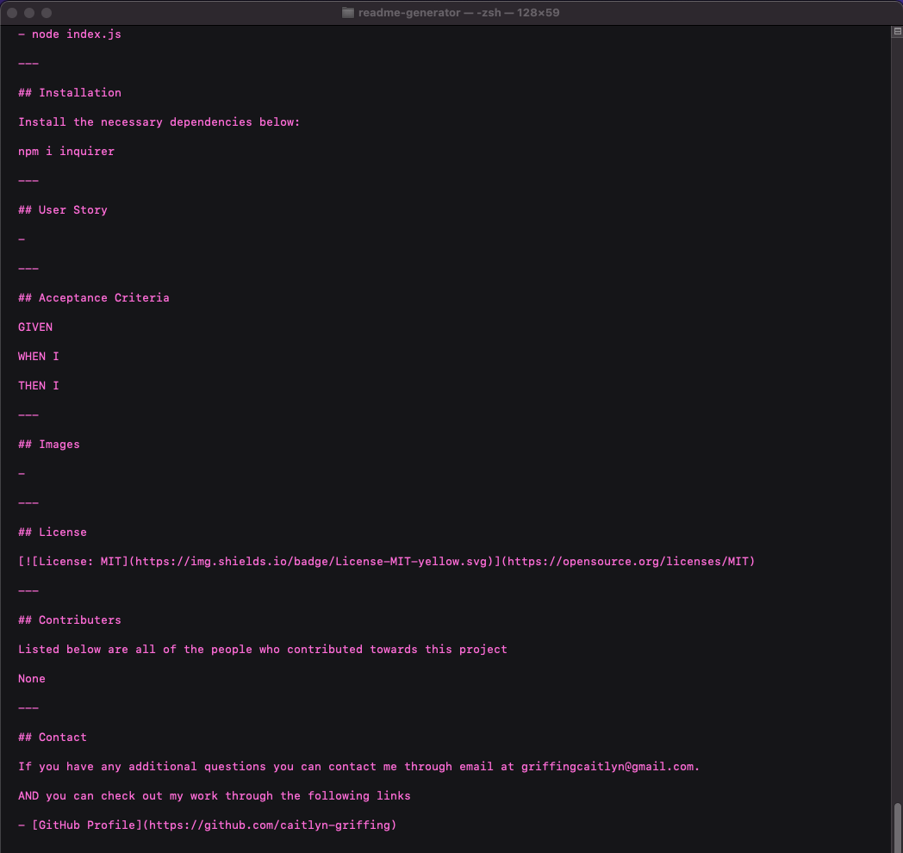

  # README Assembler

  > If you are not willing to learn, no one can help you. If you are determined to learn, no one can stop you. -Zig Ziglar

  ## Description 

  Generates a readme through command-line prompts

  ---

  ## Table of Contents:

  *[Links](#links)

  *[Usage](#usage)
  
  *[Installation](#installation)
  
  *[User Story](#userstory)
  
  *[Acceptance Criteria](#criteria)

  *[Images](#images)

  *[Tests](#tests)

  *[License](#license)

  *[Contrubuters](#contributers)

  *[Contact](#contact)

  ---

  ## Links

  - [Deployed URL](https://caitlyn-griffing.github.io/readme-generator/)

  ---

  ## Usage

  To generate this application you will need to enter the following into the command line:

  - node index.js

  ---

  ## Installation

  Install the necessary dependencies below:

  npm install inquirer

  ---

  ## User Story

  - 

  ---

  ## Acceptance Criteria

  GIVEN

  WHEN I

  THEN I

  ---

  ## Images 

  

  ---

  ## License

  

  ---

  ## Contributers

  Listed below are all of the people who contributed towards this project:

  None

  ---

  ## Contact

  If you have any additional questions you can contact me through email at griffingcaitlyn@gmail.com.

  AND you can check out my work through the following links

  - [GitHub Profile](https://github.com/caitlyn-griffing)

